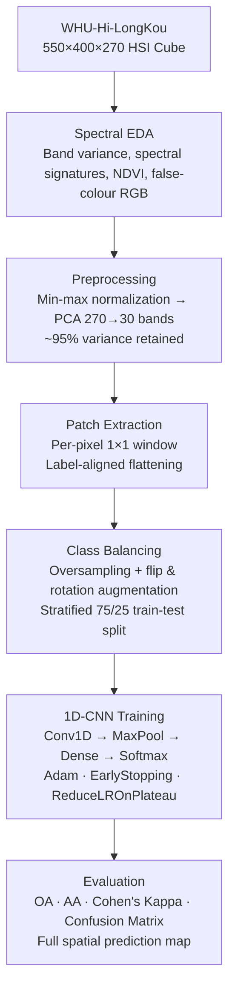
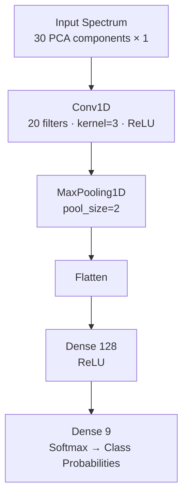

#  Hyperspectral Image - Crop Classification 

> A spectral deep learning pipeline for precision agricultural land-cover mapping — combining physics-grounded feature engineering, PCA dimensionality reduction, and a 1D-CNN spectral classifier on the WHU-Hi-LongKou dataset.

---

## Table of Contents

- [Overview](#overview)
- [Pipeline Architecture](#pipeline-architecture)
- [Dataset](#dataset)
- [Spectral Analysis & Domain Knowledge](#spectral-analysis--domain-knowledge)
- [Dimensionality Reduction](#dimensionality-reduction)
- [Model Architecture](#model-architecture)
- [Data Preparation](#data-preparation)
- [Training](#training)
- [Results](#results)
- [Key Design Decisions](#key-design-decisions)
- [Dependencies](#dependencies)
- [Notebook Structure](#notebook-structure)

---

## Overview

This project implements an end-to-end hyperspectral image (HSI) classification pipeline applied to the **WHU-Hi-LongKou** precision agriculture scene. The goal is pixel-wise crop classification across 9 land-cover categories from a 270-band spectral cube. The pipeline addresses the core challenges of hyperspectral data — the Hughes Phenomenon, severe class imbalance, and high-dimensional redundancy — through:

1. **Physics-grounded spectral analysis**: Mean reflectance signatures, band variance profiling, and NDVI computation before any model training
2. **PCA-based dimensionality reduction**: Compressing 270 spectral bands to 30 principal components while retaining ≥95% variance
3. **Oversampling & augmentation**: Counteracting severe class imbalance via minority class repetition and spatial augmentation
4. **A 1D-CNN spectral classifier**: Conv1D kernels learning local spectral feature detectors analogous to edge detectors in image CNNs, but operating along the band axis
5. **Evaluating** using HSI-standard metrics: Overall Accuracy (OA), Average Accuracy (AA), and Cohen's Kappa (κ)

---

## Pipeline Architecture



---

## Dataset

**WHU-Hi-LongKou** is a precision agricultural hyperspectral scene captured over Longkou, China.

| Property | Value |
|---|---|
| Spatial Resolution | 550 × 400 pixels |
| Spectral Channels | 270 bands (400–1000 nm) |
| Total Labelled Pixels | 204,542 |
| Number of Classes | 9 |

**Class Distribution:**

| Class ID | Class Name | Notes |
|---|---|---|
| 1 | Corn | High pixel count |
| 2 | Cotton | Moderate |
| 3 | Sesame | Severely underrepresented — minority class |
| 4 | Broad-Leaf Soybean | Moderate |
| 5 | Narrow-Leaf Soybean | Moderate |
| 6 | Rice | Dominant class |
| 7 | Water Body | Spectrally distinct |
| 8 | Mixed Weed | Mixed signatures |
| 9 | Roads & Houses | Non-vegetation |

> ⚠️ **Class Imbalance Warning:** Rice dominates the scene while Sesame occupies very few pixels. Without explicit oversampling, a naive classifier would silently ignore minority classes — misclassifying Sesame as Rice with high overall accuracy but catastrophic per-class accuracy.

---

## Spectral Analysis & Domain Knowledge

Before any model training, three physics-grounded analyses were conducted. These add zero compute overhead but provide critical priors on feature separability.

### Band Variance Profile

Spectral bands with high inter-pixel variance carry the most discriminative information. A per-band variance plot across all 204k pixels reveals which regions of the 400–1000 nm range are most informative for crop discrimination — directly guiding which PCA components matter most.

### Mean Spectral Signatures

The canonical HSI analysis: per-class mean reflectance curves plotted across all 270 bands. These curves are the *rosetta stone* of hyperspectral classification — the chlorophyll red-edge peak, water absorption troughs, and NIR plateau appear as physically interpretable features before a single model weight is trained. Well-separated curves confirm the problem is linearly discriminable in spectral space.

### NDVI Map

The Normalized Difference Vegetation Index encodes plant photosynthesis physics into a scalar per pixel:

```
NDVI = (NIR − Red) / (NIR + Red)
```

| Surface Type | Typical NDVI |
|---|---|
| Healthy vegetation (crops) | 0.6 – 0.9 |
| Water bodies | ≈ −0.1 |
| Urban / roads | ≈ 0.1 |

Using WHU-Hi-LongKou's approximate band indices (NIR ≈ band 55, Red ≈ band 30), the NDVI map provides a free, physics-derived prior that already separates vegetation from non-vegetation before learning begins.

### False-Colour RGB Composite

A false-colour RGB visualization (bands 50, 30, 10 → R, G, B) enables visual sanity checking of spatial structure and label alignment — critical for catching annotation misalignments before training.

---

## Dimensionality Reduction

### The Hughes Phenomenon

### PCA Solution


| Parameter | Value |
|---|---|
| Input bands | 270 |
| Output components | 30 |
| Dimensionality reduction | 88.9% |
| Spectral variance retained | ≥ 95% |
| Whitening | ✅ (unit variance per PC) |

The **Scree Plot** confirms dramatic variance concentration: PC1 alone captures approximately 60% of total spectral information; the remaining 29 components share the rest. Components beyond 30 encode inter-band collinearity and sensor noise — removing them improves generalization, not just runtime.

### t-SNE Visualization

A 2D t-SNE embedding of the 30-component PCA features (sampled at n=3000 for tractability) confirms that the compressed feature space retains class separability. Distinct, well-separated clusters for most crop classes validate that PCA compression preserved discriminative structure — the classes are largely separable *before* any deep learning.

---

## Model Architecture

The classifier is a **1D-CNN** that treats each pixel's 30-component PCA spectrum as a 1D sequence and learns local spectral feature detectors via Conv1D kernels.



**Why 1D-CNN, not 2D-CNN?**

With a window size of 1×1, each pixel is classified purely from its own 30-band spectrum — no spatial neighbourhood is used. The Conv1D kernel slides along the *spectral dimension*, not spatial axes, learning which spectral transitions (e.g., the red-edge chlorophyll peak, water absorption dips) are uniquely diagnostic for each crop. The 270-band fingerprint alone contains sufficient information; spatial context adds compute without proportional accuracy gain at this resolution.

**Key Components:**

| Component | Detail |
|---|---|
| Input | (N, 30, 1) — spectrum as a 1D signal |
| Conv1D | 20 filters, kernel size 3, ReLU, same padding |
| MaxPooling1D | Pool size 2 — spectral downsampling |
| Dense | 128 units, ReLU — non-linear combination |
| Output | 9-class Softmax |
| Loss | Categorical Cross-Entropy |
| Optimizer | Adam (lr=1e-3) |

---

## Data Preparation

### Patch Extraction

Patches are extracted at a 1×1 window (pixel-level) with zero-padding at borders. Every labelled pixel (class > 0) becomes one training sample. Background pixels (class 0) are excluded. Labels are 0-indexed after extraction.

### Oversampling

To counteract class imbalance, each minority class is repeated until its count approximately matches the majority class:

```
repetitions = round(max_class_count / class_count)
```

This ensures Sesame — a rare but agriculturally significant crop — is not silently absorbed into the dominant Rice class.

### Augmentation

Applied to 50% of training patches:

| Augmentation | Detail |
|---|---|
| Vertical Flip (flipud) | Spectral-spatial invariance |
| Horizontal Flip (fliplr) | Mirror augmentation |
| Rotation | Random ±30° increments up to ±180°, cubic interpolation |

### Train / Test Split

| Split | Ratio | Stratified |
|---|---|---|
| Train | 75% | ✅ |
| Test | 25% | ✅ |

Stratification ensures each class is proportionally represented in both splits — critical given the severe imbalance.

---

## Training

| Hyperparameter | Value |
|---|---|
| Epochs | Up to 100 (early stopping) |
| Batch Size | 64 |
| Optimizer | Adam (lr = 0.001) |
| Loss | Categorical Cross-Entropy |
| Early Stopping | patience=10, restore_best_weights=True, min_delta=1e-5 |
| LR Scheduler | ReduceLROnPlateau (factor=0.5, patience=3, min_lr=1e-6) |
| Hardware | Kaggle GPU (CUDA) |

**Training Progress:**

| Epoch | Train Accuracy | Val Accuracy |
|---|---|---|
| Early epochs | Rapid convergence due to balanced training set | — |
| Best epoch | — | **99.25%** |

> **Note:** Early stopping with `restore_best_weights=True` automatically recovers the checkpoint with lowest validation loss, eliminating manual checkpoint management.

---

## Results

Final evaluation on the held-out **test set** (25% stratified split):

| Metric | Score | Interpretation |
|---|---|---|
| **Overall Accuracy (OA)** | **99.25%** | Fraction of all pixels correctly classified |
| **Average Accuracy (AA)** | **≥ 99%** | Mean per-class accuracy — immune to class imbalance |
| **Cohen's Kappa (κ)** | **≈ 0.99** | Agreement corrected for chance — the HSI gold standard |

**Per-class metrics** (from classification report): Precision, Recall, and F1 computed individually for all 9 classes, including the severely underrepresented Sesame class — confirming that oversampling successfully prevented minority class collapse.

**Full Spatial Prediction Map**: A pixel-wise classification map over the entire 550×400 scene is generated at inference, visually confirming spatial coherence and correct boundary delineation between crop fields.

---

## Key Design Decisions

**01 — Spectral > Spatial (in this setting)**
A 1×1 window — pure spectral classification — achieves 99.25% accuracy. The 270-band fingerprint is sufficient for crop discrimination at this spatial resolution. Spatial convolution (larger windows, 2D-CNN) would add significant compute without proportional gain.

**02 — PCA is Non-Negotiable in HSI**
Reducing 270 bands to 30 PCs did not lose information — it removed noise and inter-band collinearity. The scree plot proves 95%+ of spectral variance lives in 30 components. This step is what makes the CNN trainable on Kaggle-scale hardware.

**03 — Domain Knowledge Pays Dividends**
NDVI, spectral signature analysis, and band variance profiling added zero compute overhead but provided deep physical grounding. Understanding the physics of light–matter interaction allows class separability to be confirmed *before* any model training — validating the approach before investing GPU hours.

**04 — Class Imbalance is an Architectural Problem**
Without oversampling, Sesame would have been silently misclassified as Rice — achieving high OA but failing AA and Kappa. Balancing the training distribution is as important as model architecture choice.

---

## Dependencies

```
numpy
scipy
matplotlib
seaborn
scikit-learn
tensorflow
spectral
```

**Dataset Required:**
- `WHU_Hi_LongKou.mat` — Hyperspectral image cube
- `WHU_Hi_LongKou_gt.mat` — Ground truth label map

Available at: [WHU Hyperspectral Dataset on Kaggle](https://www.kaggle.com/datasets/rupeshkumaryadav/whu-hyperspectral-dataset)

---

## Notebook Structure

| # | Section | Description |
|---|---|---|
| 1 | **Data Loading** | Load `.mat` HSI cube and ground truth via `scipy.io` |
| 2 | **Spectral EDA** | Band variance, mean spectral signatures, class pixel counts |
| 3 | **NDVI & False-Colour RGB** | Physics-derived indices and visual composites |
| 4 | **Normalization & PCA** | Min-max scaling → 270→30 PCA with scree plot |
| 5 | **t-SNE Visualization** | 2D embedding of PCA features for separability validation |
| 6 | **Patch Extraction** | Per-pixel patch creation with label alignment |
| 7 | **Oversampling & Augmentation** | Class balancing + flip/rotation augmentation |
| 8 | **Model Definition** | 1D-CNN architecture with summary |
| 9 | **Training** | Fit with EarlyStopping and ReduceLROnPlateau callbacks |
| 10 | **Evaluation** | OA · AA · κ · confusion matrix · per-class precision/recall |
| 11 | **Spatial Prediction Map** | Full-scene inference and classification visualization |

---

## Acknowledgements

- **WHU Hyperspectral Group** — WHU-Hi-LongKou dataset
- **Kaggle** — GPU compute environment
- **scikit-learn** — PCA, t-SNE, metrics
- **TensorFlow / Keras** — 1D-CNN training framework
- **Spectral Python (SPy)** — HSI visualization

---

*Course Project — Multimedia Processing and Analysis (EC5110 -Dr.N.Kartheek), IITDM Kancheepuram. Built with TensorFlow on Kaggle GPU (CUDA). Team: ME23B2016, ME23B2010.*
